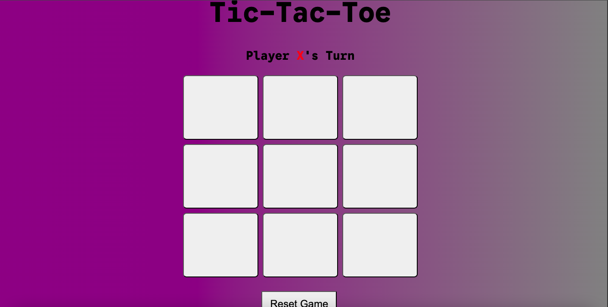
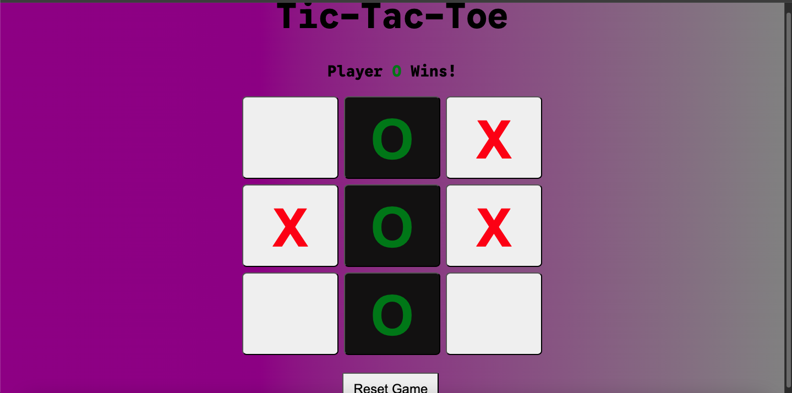

# TicTacToe

### I wanted to make a game to practice JavaScript, so I thought building a Tic-Tac-Toe game from scratch would be a good challenge.

### I added all the features that seem necessary for this kind of game. First, I added the basic logic for the game such as the winning conditions for each player, the player turn switching after every tile is clicked, and once the game is over, not allowing any other tiles to be clicked. I also added a reset button to end the game and start a new game from scratch.

